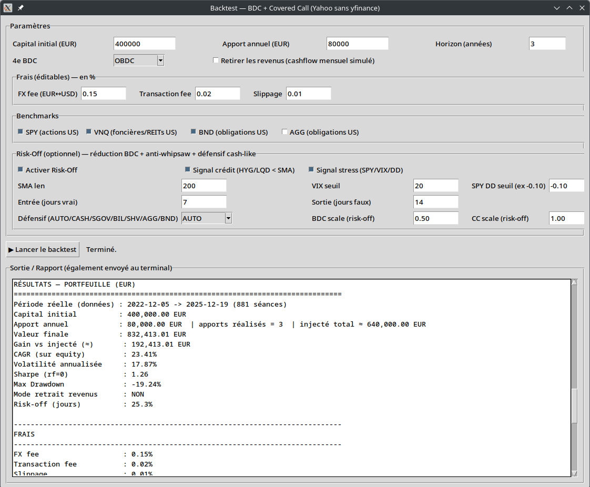

# IncomeShield

# Backtest GUI — BDC + Covered Call + Risk-Off (Yahoo sans yfinance)

Ce projet est un **outil de backtest en Python (GUI Tkinter)** conçu pour simuler un **portefeuille US orienté rendement** combinant :

- **BDC** (Business Development Companies : crédit privé, sensible au cycle)
- **ETF/CEF Covered Call** (JEPI / JEPQ / DIVO / BST : rendement + bêta réduit)
- **Benchmarks** (SPY, VNQ, BND, AGG)
- Un mode optionnel **Risk-Off** qui **réduit automatiquement l’exposition au crédit** et réalloue vers un actif défensif **cash-like** (ex : SGOV/BIL/SHV) ou obligations (AGG/BND) ou cash.

L’objectif n’est pas de “maximiser le CAGR” à tout prix, mais de construire un profil plus **robuste inter-cycles** :  
➡️ **rendement mensuel + limitation de l’érosion** pendant les phases de stress.

---

## Fonctionnalités principales

### Données & robustesse
- Récupération des données via **Yahoo Finance chart endpoint** (sans `yfinance`)
- Série **journalière propre** : 1 ligne par jour (dédoublonnage)
- Utilise **Adj Close** quand disponible (approximation du total return)

### Paramétrage portefeuille
- Capital initial + apports annuels
- Rebalancement **mensuel**
- Choix du “4e BDC” (OBDC ou CSWC)
- Frais simulés :
  - frais FX (EUR→USD)
  - frais de transaction
  - slippage

### Sorties
- `equity_curve.csv` : courbe de capital + détails positions
- `trades.csv` : journal des trades + frais
- `monthly_report.csv` : perf mensuelle, drawdown mensuel, risk-off %

### Option “retrait revenus”
- Optionnel : simule un retrait de “revenus” (approximation) via cash, sans ventes forcées.

---

## Mode Risk-Off (optionnel)

Le mode Risk-Off a été conçu pour **réduire l’exposition au risque crédit** quand l’environnement devient défavorable, tout en conservant une partie du moteur de rendement.

### 1) Signaux (au choix)
**Signal crédit**
- Ratio `HYG / LQD` sous sa **SMA(n)**  
  (proxy simple d’un environnement “risk credit”)

**Signal stress**
- `(SPY < SMA(n) AND VIX > seuil)`  
  **OU**
- drawdown de SPY sous un seuil (ex : -10%)

### 2) Anti-whipsaw (réduction des faux signaux)
Pour éviter les allers-retours inutiles :

- **Entrée risk-off** : condition vraie pendant **N séances** (ex : 7)
- **Sortie risk-off** : condition fausse pendant **M séances** (ex : 14)

➡️ Objectif : réduire le “whipsaw” et rendre les transitions plus stables.

### 3) Action de réallocation (risk-off)
Le portefeuille est séparé en deux blocs :
- **BDC** (crédit cyclique)
- **Covered call** (bêta plus faible, amortisseur de volatilité)

En mode risk-off :
- Les BDC sont **réduites** via un facteur `BDC scale` (ex : 0.50 → BDC 60% devient ~30%)
- Les Covered Call peuvent rester inchangées (ex : `CC scale = 1.00`) ou être réduites si souhaité.
- La poche libérée est allouée vers un actif défensif :
  - **cash-like** : `SGOV / BIL / SHV` (recommandé en stress de taux)
  - ou `AGG / BND`
  - ou `CASH`

---

## Logique algorithmique (vue d’ensemble)

### 1) Téléchargement et préparation des prix
- Télécharge toutes les séries nécessaires (portefeuille, FX, benchmarks, signaux).
- Fusionne en une table prix daily, forward-fill, nettoie et aligne les dates.

### 2) Construction du calendrier d’événements
- Rebalancement : 1x / mois (première séance de chaque mois)
- Apports annuels : anniversaires de la date de départ (corrigé pour éviter l’erreur “fin de série”)

### 3) Calcul du flag Risk-Off (si activé)
- Calcule les conditions (crédit/stress)
- Applique la logique **anti-whipsaw** (entrée/sortie avec compteurs)
- Produit un `riskoff_daily` (True/False) sur chaque séance

### 4) Rebalancement (cœur du moteur)
À chaque date d’événement :
- Calcule la valeur totale du portefeuille (positions + cash)
- Détermine la cible de poids selon régime :
  - **risk-on** : poids “normaux”
  - **risk-off** : BDC réduites, défensif augmenté
- Passe les ordres :
  - vend d’abord ce qui est au-dessus de la cible
  - achète ensuite ce qui est sous la cible
  - applique frais + slippage
  - respecte un éventuel `cash target` en mode CASH défensif

### 5) Reporting
- Courbe de capital (EUR) via conversion FX (USD→EUR)
- Métriques : CAGR, volatilité annualisée, Sharpe, max drawdown
- Agrégation mensuelle :
  - performance mensuelle
  - drawdown mensuel
  - % de jours en risk-off
  - cashflow retiré (si option activée)

---

## Résumé d’analyse (exemple de run)

### Contexte de la période testée
- Période : **05/12/2022 → 19/12/2025**
- Marché globalement haussier mais **très heurté** (phases de stress et rotations)
- Instruments dominants :
  - BDC : crédit privé, sensible au cycle
  - Covered Call : rendement + bêta réduit

➡️ L’objectif visé est un **rendement régulier** avec une **résistance en stress**, pas un “max CAGR” à tout prix.

### Résultats clés (avec Risk-Off + anti-whipsaw + défensif cash-like)
| Indicateur | Valeur |
|---|---:|
| Capital injecté | 640 000 € |
| Valeur finale | 832 413 € |
| Gain net | +192 413 € |
| CAGR | 23,41 % |
| Volatilité | 17,87 % |
| Sharpe (rf=0) | 1,26 |
| Max Drawdown | -19,24 % |
| Jours en risk-off | 25,3 % |

➡️ **Très bon compromis rendement / risque**, cohérent avec une stratégie “income-oriented”.

### Comparaison implicite avec une version sans risk-off
- Sans risk-off : CAGR ~23,6% ; vol ~19,0% ; DD ~-22% ; Sharpe ~1,21
- Avec risk-off + anti-whipsaw + cash-like : CAGR ~23,4% ; vol -1,1pt ; DD -3pt ; Sharpe 1,26

➡️ Le système **réduit volatilité et drawdowns** avec un **coût d’opportunité faible**.

### Ce qui marche dans le Risk-Off (et pourquoi)
- Anti-whipsaw (ex : entrée 7j / sortie 14j) :
  - transitions plus lentes, moins de faux signaux
  - risk-off ~25% du temps, pas 50–60%
- Défensif cash-like (SGOV/BIL/SHV) :
  - mieux adapté que AGG en régime de stress de taux (duration quasi nulle)
- Réduction BDC + maintien partiel covered call :
  - baisse du bêta sans casser le moteur de rendement
  - les primes d’options peuvent rester élevées en stress

### Limites à connaître
- Backtest sur fenêtre encore courte (3 ans)
- Adj Close Yahoo ≠ reconstruction parfaite des cashflows (dividendes/ROC)
- Fiscalité non intégrée
- BDC : sensibles aux crises systémiques type 2008 (stress crédit extrême)

### Verdict
Ce backtest met en évidence un modèle :
- **crédible**
- **robuste**
- cohérent pour “revenu long terme + préservation du capital”

Ce n’est pas une “money machine”, mais un **portefeuille de rentier rationnel**.

---

## Installation

pip install -U requests numpy pandas

Les CSV sont exportés automatiquement dans un dossier horodaté :

~/backtest_bdc_cc_gui/YYYYMMDD_HHMMSS/

Ce projet est un outil d’exploration et d’illustration.
Il ne constitue pas un conseil financier.
Les résultats passés ne préjugent pas des performances futures.
